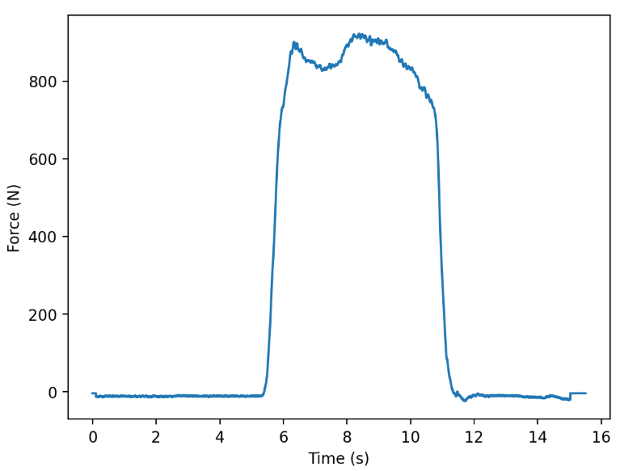

]
[]

# Rate of Force Development Calculator App
This is a Streamlit app that will take an isometric force time-series and calculate RFD through either automated or manual detection methods

[You can access the app here](https://rfd-calculator.streamlit.app/)

The app.py file creates a streamlit app that accepts inputs from the user, 
calculates commonly used metrics for rate of force development (RFD) based 
on user responses, and visualizes those values for you. The app consists of 
five pages which provide a step-by-step walkthrough. 

## Page 1: Importing and Calibrating Your Data

In the first step, you can select a force file of your own and upload it to the
app. The file should be uploaded as either a .txt or .csv file, and contain 
only two columns of data - column 1 should be your time series, and column 2 
should be the force reading from a dynamometer or load cell. The data you 
upload should look like the table below. 

|Time (s)|Force (V)|
|--------|---------|
|0.000   |0.050    |
|0.001   |0.052    |
|0.002   |0.048    |
|0.003   |0.053    |
|0.004   |0.051    |
|0.005   |0.053    |
|0.006   |0.068    |
|0.007   |0.079    |
|0.008   |0.092    |
|0.009   |0.117    |
|0.010   |0.134    |
|--------|---------|
**Table 1.** Example force-time curve structure.

If your force data consists of uncalibrated voltage readings, you can also 
upload a calibration file in this step to convert from Volts to Newtons using 
linear regression. 

Once you have uploaded your data and calibrated if necessary, click the button 
to proceed to Step 2.

## Page 2: Preprocessing Your Data

In Step 2, you will see a figure showing your force data uploaded in Step 1. If
you elected to calibrate your data, you will see the calibrated output. From 
here, inspect the figure for anomalies (countermovement, pretension, etc.) and 
provide preliminary inputs about how you want your data to be treated. The 
first question asks when the contraction was supposed to start. In the example
 image below, the recording lasts for 15 seconds - 5 seconds of steady baseline
 recording, 5 seconds of maximal contraction, and 5 seconds of rest at the end. 
 
 
 **Figure 1.** Example isometric force trace.
 
 In this trial, since the contraction was supposed to start at exactly 5 
 seconds, 5.000 should be entered. This will be used to produce an onset 
 visualization in Step 3. 
 
 The only other questions here relate to whether your force output requires 
 offset correction, which you should be able to see from the visual trace, and
 whether or not you would like to filter your data before calculating RFD. If
 yes is selected, data are filtered using a 4th-order, low-pass Butterworth 
 filter with a cutoff frequency of 15 Hz by default. These settings can be 
 changed by adjusting the values on the slider bars. Lastly, enter the sampling rate of 
 your force device, which will be used in the data filtering process.
  
Once the appropriate inputs are selected for your file, proceed to Step 3. 

## Page 3: Inspecting your dataset

In Step 3, you will be asked to provide inputs related to how you want to calculate 
Rate of Force Development (RFD).

First, select a method for determining the onset of contraction. 

## Manual Onset Determination
If you select "Manual Onset Determination", a force-time curve will appear 
that is isolated to the time window you listed for when the contraction was 
supposed to start. 

The default viewing window is 300ms centered around the expected onset, but 
this can be adjusted using the slider on the screen. If the contraction starts 
earlier or later than expected, you may need to go back to Step 2 to adjust the
expected start time. 

Once you have a viewing window that clearly shows the noise in the baseline 
signal as well as a clear rise in force, you can hover your cursor over the 
figure to see both time and force information. With this, you can use whatever 
manual method you wish to determine the exact moment of onset. Once this is 
determined, enter the timing information into the text box below the figure. 

## Automated Onset Calculation

The other option is to calculate the onset automatically 
as the first sample that exceeds the mean of the baseline signal by at least 
+3 standard deviations. 

## RFD Metric Selection and Calculation

Once you have selected the method for determining your contraction onset and 
provided the necessary inputs, you can select which RFD variables you would 
like to calculate. By default, RFD0-50, RFD0-100, and RFD0-200 are returned, 
but you can deselect any variables you'd like.

Once you're done, click the button to Proceed to Step 4.

## Step 4: View and Download RFD Values

Once you move past Step 3, you should see two figures followed by the RFD 
values you selected. 

The figure on the left should be your full force-time curve, with a red horizontal 
line indicating the onset of contraction where it intersects with the curve, and
a series of colored dots corresponding to the relevant time points used for calculating RFD. 
For example, if you selected RFD0-50 as a metric, you should see a blue dot corresponding to 
the sample that occurred 50ms after onset. 

You can also download your image and data, respectively. At this point, you're done!

If you are having any issues with the app, please feel free to raise an issue
[here]('https://github.com/nacoker/rfd_calculator_app/issues').
